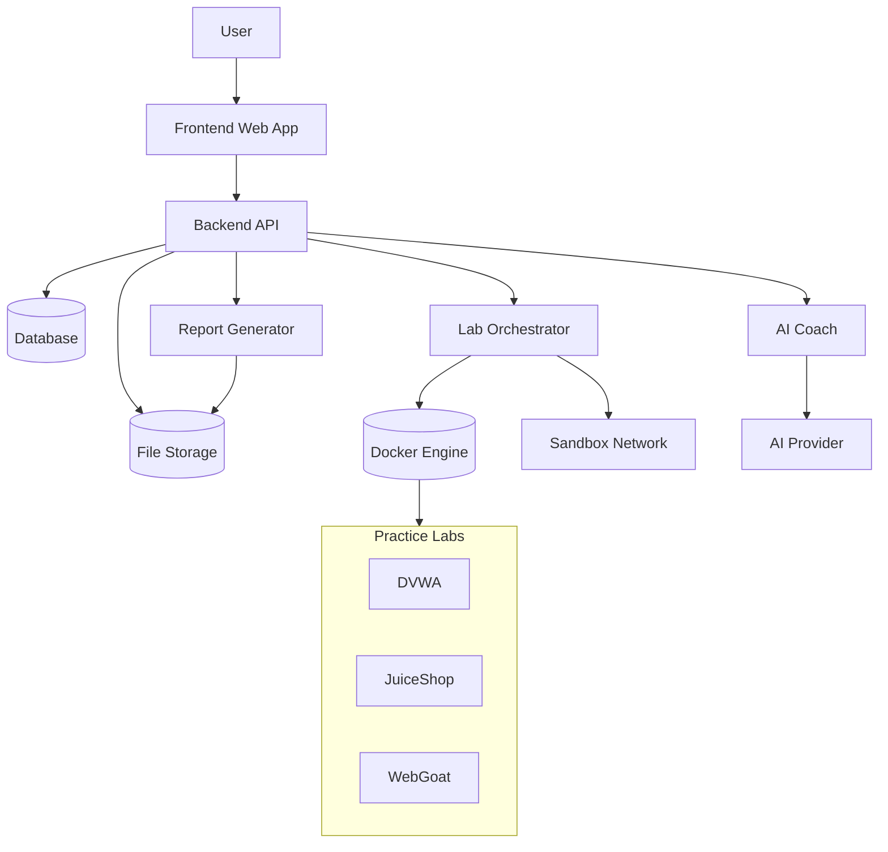

# The_Secure_Stack
This project is a web-based cybersecurity training platform designed to provide hands-on, safe, and guided practice in a controlled environment. Users can launch isolated vulnerable labs using Docker, create practice sessions, and capture outputs from common security tools such as Nmap and Nikto. The platform uses an AI-powered coach to explain tool results, assess potential risks, suggest next steps, and provide remediation guidance, all while operating within strict safety boundaries. Sessions and findings are stored for review and can be exported as a final report, making the platform suitable for both learning and demonstration purposes in an academic setting.

### Explanation
The user interacts with a React frontend, which talks to a FastAPI backend.
The backend manages authentication, sessions, and logs, controls Docker-based labs through an orchestrator, stores data in the database, and sends tool output to the AI coach.
The AI returns explanations and guidance, and everything is compiled into a final report.

## Recommended File Structure
```text
capstone-platform/
│
├── README.md
├── .env.example
├── docker-compose.yml        # Run full system locally
│
├── frontend/                 # React web app
│   ├── package.json
│   └── src/
│       ├── api/              # API calls to backend
│       │   └── client.js
│       ├── pages/
│       │   ├── Login.jsx
│       │   ├── Dashboard.jsx
│       │   ├── Session.jsx
│       │   └── Report.jsx
│       ├── components/
│       │   ├── LabControls.jsx
│       │   ├── LogViewer.jsx
│       │   ├── AIFeedback.jsx
│       │   └── Navbar.jsx
│       ├── auth/
│       │   └── authContext.jsx
│       ├── App.jsx
│       └── main.jsx
│
├── backend/                  # FastAPI backend
│   ├── requirements.txt
│   └── app/
│       ├── main.py           # FastAPI entry point
│       │
│       ├── auth.py           # JWT + roles
│       ├── database.py       # DB connection
│       ├── models.py         # SQLAlchemy models
│       ├── schemas.py        # Pydantic schemas
│       │
│       ├── labs.py           # Start/stop/reset labs
│       ├── sessions.py       # Session creation + state
│       ├── logs.py           # Tool output ingestion
│       ├── ai.py             # AI coach logic
│       ├── reports.py        # HTML/PDF report export
│       │
│       └── utils.py          # Helpers
│
├── labs/                     # Docker practice labs
│   ├── dvwa/
│   │   ├── docker-compose.yml
│   │   └── README.md
│   ├── juice-shop/
│   │   ├── docker-compose.yml
│   │   └── README.md
│   └── lab_registry.json     # List of supported labs
│
├── reports/                  # Generated reports (gitignored)
│
└── tests/                    # Minimal backend tests
    ├── test_auth.py
    ├── test_sessions.py
    └── test_labs.py
```
### Explanation
We separated the project into three main parts:
a React frontend, a FastAPI backend, and Docker-based practice labs.
The backend manages authentication, sessions, lab orchestration, AI analysis, and reporting, while the frontend provides a clean UI for controlling labs and viewing results.

## Team Ownership
- Frontend engineer
- Backend + AI
- DevOps
- QA & Testing
