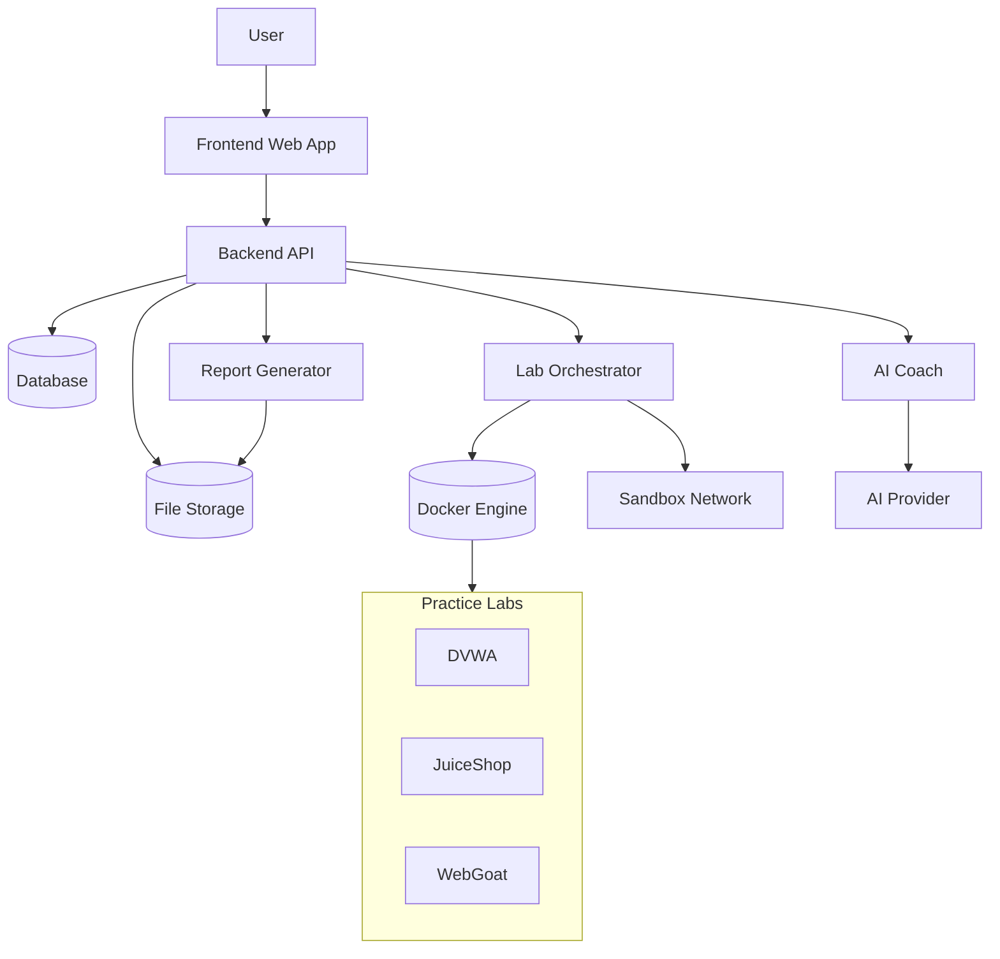

# The_Secure_Stack

### Explanation
The user interacts with a React frontend, which talks to a FastAPI backend.
The backend manages authentication, sessions, and logs, controls Docker-based labs through an orchestrator, stores data in the database, and sends tool output to the AI coach.
The AI returns explanations and guidance, and everything is compiled into a final report.

